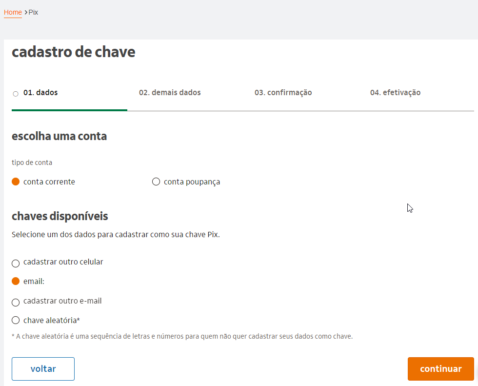
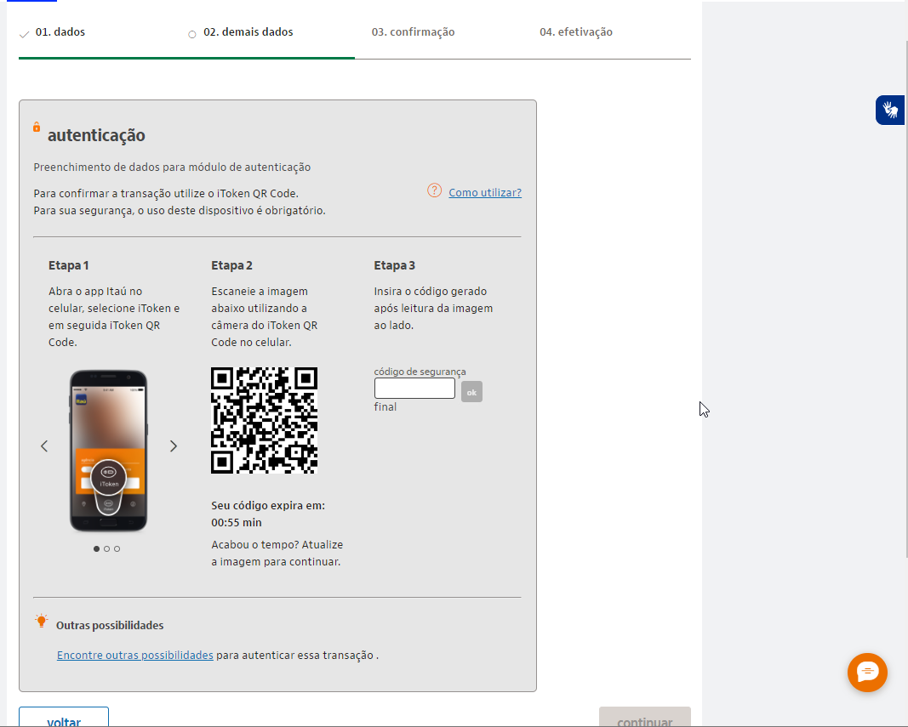

# Teste técnico para TW - Zup Itaú

- [Teste técnico para TW - Zup Itaú](#teste-técnico-para-tw---zup-itaú)
  - [Contexto (narrativa)](#contexto-narrativa)
  - [Público](#público)
  - [Dispositivos para a configuração](#dispositivos-para-a-configuração)
  - [Linguagem](#linguagem)
  - [Local de publicação do documento](#local-de-publicação-do-documento)
  - [Levantamento PIX](#levantamento-pix)
    - [Tipos de chave PIX](#tipos-de-chave-pix)
    - [Quantidade de chaves PIX que podem ser cadastradas](#quantidade-de-chaves-pix-que-podem-ser-cadastradas)
    - [Repetição de chave PIX](#repetição-de-chave-pix)
  - [Exploração da configuração](#exploração-da-configuração)
    - [Mobile: App do Itaú no celular](#mobile-app-do-itaú-no-celular)
    - [Internet: Site do Itaú e App no computador](#internet-site-do-itaú-e-app-no-computador)
  - [Programas usados](#programas-usados)
  - [Tutorial (entrega)](#tutorial-entrega)

---

## Contexto (narrativa)

 Você atua como Technical Writer em uma empresa e o Product Manager do projeto que você faz parte pediu um tutorial de como utilizar o produto. Para isso, ele te orientou a criar um repositório no Github e escrever em markdown um texto com o tema "Como
 configurar sua chave PIX".

---

## Público

Usuários de Pix do banco Itaú. Pessoa física e jurídica.

---

## Dispositivos para a configuração

- Mobile (app) e internet (site e app no computador).

---

## Linguagem

- **Voz e tom do Itaú:** a voz do Itaú é de credibilidade, consistência e o tom é de acolhimento. O Itaú entende as pessoas, quer abraçá-las, acolhê-las do jeito que são. Mais do que isso, ele está disponível para ajudá-las a realizar os seus sonhos. Por isso o tom de voz é suave, amigável. <https://www.linkedin.com/pulse/tom-de-voz-e-marcas-com-atitude-adriano-frachetta/>
  
- **Internacionalização:** não existe opção de troca de idioma no site do Itaú.

---

## Local de publicação do documento

- Github (arquivo Markdown)
- Final: É uma documentação pública, portanto [na área de documentação do site do banco Itaú](https://www.itau.com.br/atendimento-itau/para-voce)
  
  > **Importante:** Não precisa estar logado no site/app para acessar o documento.

---

## Levantamento PIX

### Tipos de chave PIX

| Chave | Descrição |
| ----- | ----- |
| **CPF** ou **CNPJ** | Presente no cadastro da conta do banco de pessoa física (**CPF**) ou pessoa jurídica (**CNPJ**) |
| **E-mail** | Endereço de e-mail informado no cadastro no banco ou outro, sempre mediante validação por recebimento de código |
| **Celular**| Número do celular presente no cadastro do banco ou outro, sempre mediante validação por recebimento de código |
| **Chave aleatória**| Código alfanumérico (letras e números) de 32 caracteres, gerado aleatoriamente pelo Banco Central |

### Quantidade de chaves PIX que podem ser cadastradas

Limite de chaves para cada tipo de conta (corrente e poupança):

- **Pessoa física:** até 5 chaves por conta.
- **Pessoa jurídica:** até 20 chaves por conta.

### Repetição de chave PIX

A chave Pix é **exclusiva** entre as contas e entre todas as demais instituições financeiras. Se a informação já estiver em uso, não poderá ser cadastrada novamente. Porém, é possível solicitar a portabilidade da chave.

---

## Exploração da configuração

### Mobile: App do Itaú no celular

**Pré-requisitos:**

- iToken válido

**Telas:**

- Minhas chaves Pix:
  
  

- Seleção de tipos de chave Pix:
  
  

### Internet: Site do Itaú e App no computador

Utilizam praticamente a mesma interface.

**Pré-requisitos:**

- Site: Guardião Itaú 30 horas instalado.
- App no computador: instalação completa e iToken válido no app.
- Ambos: Acesso ao app Itaú no celular para a autenticação com o iToken QRCode no final do cadastro de chaves Pix.

**Telas:**

- Cadastro de chave
  

- Autenticação
  

---

## Programas usados

- VSCode
- GitHub
- ShareX (Imagens)

---

## Tutorial (entrega)

O tutorial está disponível em [Como configurar sua chave Pix](configurar-pix/configurar-chave-pix.md)