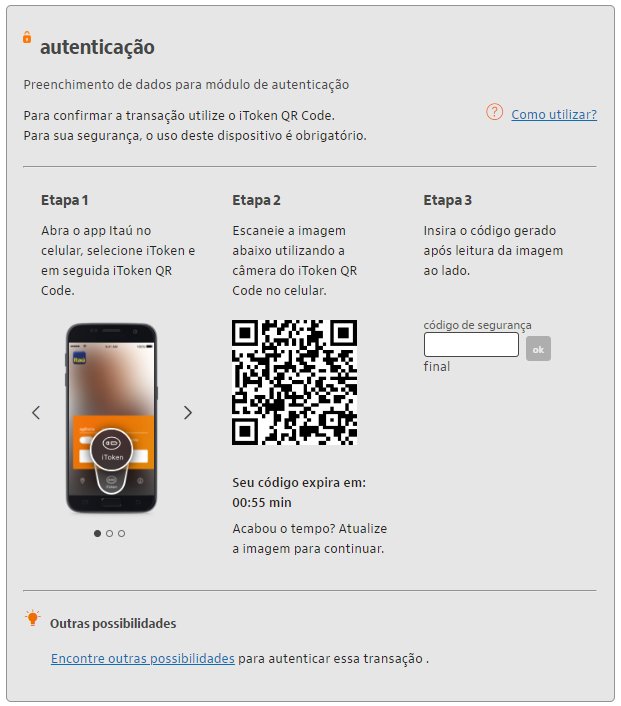

# Como configurar sua chave PIX

Pense que este tutorial poderia ser publicado em uma documentação pública. Por isso, além do texto, seria interessante entender como você estruturaria as informações da página com menu, submenu e demais recursos, como tabelas, listas ou tabs. Queremos conhecer seu processo de criação e organização do conhecimento!

---

## Levantamento de informações

### Público

- Pessoa física ou jurídica? Quais as diferenças no cadastro/conceito e no layout de configuração?

### Meio

- Em qual dispositivo: mobile ou internet, ou ambos?
- Também é possível fazer no caixa eletrônico e/ou presencialmente no banco?

### Linguagem

- Voz e tom do Itaú: a voz do Itaú é de credibilidade, consistência e o tom é de acolhimento. O Itaú entende as pessoas, quer abraçá-las, acolhê-las do jeito que são. Mais do que isso, ele está disponível para ajudá-las a realizar os seus sonhos. Por isso o tom de voz é suave, amigável. <https://www.linkedin.com/pulse/tom-de-voz-e-marcas-com-atitude-adriano-frachetta/>
  
- Internacionalização: Português e inglês? Não encontrei opção de troca de idioma no site do Itaú.

### Onde será publicado?

- É uma documentação pública. Site do banco <https://www.itau.com.br/atendimento-itau/para-voce>
  
  > **Importante:** Não precisa estar logado no site/app para acessar o doc.

### PIX

- Quais tipos de chave PIX existem?

  > Pesquisar diretamente no meu celular e site do Itaú.

- Como configurar cada tipo. Qual o passo a passo?

  > Verificar se existe alguma validação do tipo de dado e propriedade da informação (exemplo, esse o telefone, é seu?).

- Fazer imagens das etapas mais importantes do tutorial e remover dados que identifiquem o usuário logado.
  
  **Importante:** Encontrar dados fictícios de clientes para fazer as imagens.

- Se for mobile, existe alguma diferença para celulares Android e iPhone?

  > Pesquisar no site do Itaú.

## Programas usados

- VSCode
- GitHub
- ShareX (Imagens)
- Power Point - Office365 (Apresentação)

---

## Menu

- PIX
- Pix - pagamento instantâneo

### Descobertas:

- As chaves PIX de pessoa física possuem 2 tipos principais:

  - Conta corrente
  - Conta poupança

<https://www.bcb.gov.br/meubc/faqs/p/O-que-e-chave-pix>

Pessoas físicas podem cadastrar até 5 chaves para cada conta.
Pessoas jurídicas, até 20 chaves.

A chave é como um apelido da sua conta. Você pode usar seu CPF/CNPJ, email, número de celular ou criar uma chave aleatória.

As chaves não podem ser repetidas, logo, se você utiliza o CPF como chave Pix em uma conta de um banco, esse código não poderá ser utilizado na conta de outra instituição financeira, a não ser que o usuário solicite a portabilidade.

---

## Como cadastrar a minha chave Pix?

Criar uma chave Pix é como criar um apelido para a sua conta. Você pode usar o seu CPF/CNPJ, e-mail, número de celular ou ainda criar uma chave aleatória, sem os seus dados pessoais, se preferir...

Assim, outros usuários podem enviar pagamentos para você usando apenas um desses dados. Veja como é simples cadastrar:

### Mobile

1. Abra o app Itaú e toque em **Área Pix**.
2. Acesse sua conta, informando os seus dados.
3. Toque em **minhas chaves**.
4. Toque em **Cadastrar ou trazer chave Pix**.
5. Indique se essa chave será usada para as transações da sua conta **corrente** ou **poupança**.
6. Agora, escolha **qual dado deseja usar como sua chave pix** e siga as instruções da tela.

     - **CPF (pessoa física) ou CNPJ (pessoa jurídica):** já vem preenchido com o número do seu cadastro, então é só selecionar essa opção.

     - **e-mail ou celular:**
       - Use o do seu cadastro (já vem preenchido) ou informe outro agora e toque em **continuar**.

          Você receberá um **e-mail** ou **SMS** contendo um código de validação.

       - Digite o **código** recebido e toque em **continuar**.

     - **chave aleatória:** para gerar um código de letras e números exclusivo para você, basta selecionar essa opção.
  
7. Verifique se está tudo certo e toque em **confirmar**.

Pronto! A sua chave Pix está cadastrada e já pode ser usada para as transferências.

---

**Dica:** Existe um limite de chaves por tipo de conta (corrente e poupança):

- Pessoa física: você pode criar até 5 chaves para cada uma das suas contas.
- Pessoa jurídica: você pode criar até 20 chaves para cada uma das suas contas.

---

**Observação:** A chave Pix é única entre todos os bancos. Caso você tente configurar uma chave que já está cadastrada em outro banco não será permitido.

---

### Internet

1. No [site do Itaú](https://www.itau.com.br/) ou app Itaú no computador, acesse sua conta informando os seus dados.
2. Na sua página inicial, clique em **Pix**.
3. Clique em **cadastrar chave Pix**.
4. Indique se essa chave será usada para as transações da sua conta **corrente** ou **poupança**.
5. Agora, selecione qual dado deseja usar como chave pix.

     - **CPF (pessoa física) ou CNPJ (pessoa jurídica):** já vem preenchido com o número do seu cadastro, então é só selecionar essa opção.

     - **e-mail ou celular:**
       - Selecione **e-mail** ou **celular** para usar as informações do seu cadastro ou selecione **cadastrar outro e-mail/celular** e informe agora. Clique em **continuar**.

          Você receberá um **e-mail** ou **SMS** contendo um código de validação.

       - Digite o **código** recebido e clique em **continuar**.

     - **chave aleatória:** para gerar um código de letras e números exclusivo, sem os seus dados, basta selecionar essa opção.
  
6. Antes de confirmar a transação, faça a autenticação. Para isso:

   - Informe a senha do cartão com 6 dígitos e clique em **continuar**.

   - Utilize o **iToken QRCode** do seu celular para ler a imagem e gerar o código de segurança. Digite o código e clique em **ok**.

     

7. Para finalizar, verifique se está tudo certo e clique em **confirmar**.

Pronto! A sua chave Pix está cadastrada e já pode ser usada para as transferências.
